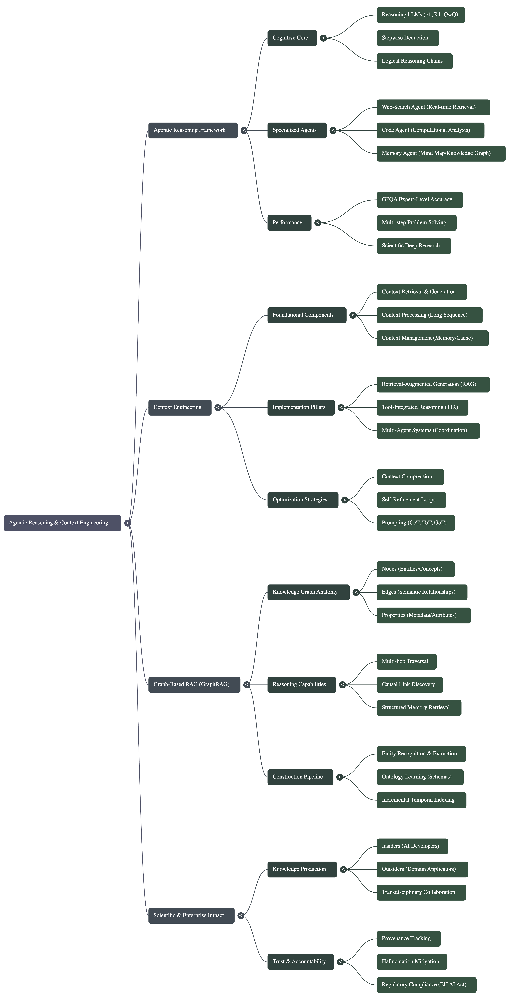

# A Curated Resource Guide: The Convergence of AI Agents, Knowledge Graphs, and Context Engineering

The field of artificial intelligence is witnessing a strategic shift away from passive, inference-based Large Language Models (LLMs) toward proactive, tool-using systems. This new paradigm, often termed Agentic AI, moves beyond static, pre-trained knowledge to solve dynamic, real-world problems. This evolution is critical for tackling complex challenges that require deep research, multi-step deduction, and direct interaction with external environments—tasks that traditional LLMs, confined to their internal knowledge, cannot perform effectively.

Agentic AI frameworks are built on a set of core principles that enable this advanced capability. These systems are typically composed of three key components: a Cognitive Core, a dynamic Knowledge Base, and an extensible Toolset. The Cognitive Core, often a fine-tuned LLM, serves as the system's "brain," responsible for reasoning, planning, and synthesizing information. This core is connected to a continuously updated Knowledge Base that provides it with current, domain-specific information, overcoming the static knowledge limitations of its training data. Finally, the Toolset grants the agent the ability to interact with the outside world through functions like web searches, code execution, or analysis of scientific papers. By integrating these components, agentic systems can dynamically gather information, perform complex computations, and construct structured reasoning chains to arrive at accurate, well-supported conclusions. This three-part architecture is exemplified by frameworks such as the Knowledge-Extractor for Domain-Expert Agents, where a fine-tuned LLM serves as the cognitive core, powered by a continuously updated knowledge base and an extensible toolset for interacting with scientific literature.

## Key Resources on Agentic AI

The following resources provide essential insights into this paradigm shift, highlighting frameworks that demonstrate superior performance and introduce novel architectural concepts for building sophisticated AI agents.

* Agentic Reasoning Framework: This framework enhances LLM reasoning by integrating a suite of external tool-using agents, including web search and code execution. A key innovation is its "Mind Map agent," which constructs a structured knowledge graph in real-time to track logical relationships and improve deduction, using a process similar to that in GraphRAG that applies community clustering to group themes. Evaluations show this approach significantly outperforms existing Retrieval-Augmented Generation (RAG) systems on complex, PhD-level scientific reasoning tasks. The framework is open-source and available on GitHub (https://github.com/theworldofagents/Agentic-Reasoning).
* Knowledge-Extractor Framework for Domain-Expert Agents: A self-evolving framework designed to build and maintain domain-expert agents, exemplified by the "Hydrogen-Agent" for hydrogen energy research. It employs a "Hybrid Knowledge Integration" strategy that combines a fine-tuned LLM (the cognitive core) with a continuously updated knowledge base and an autonomous toolset (PolicyRetriever, WebBrowser, ArxivAnalyzer). This design allows the agent to maintain sustained expertise in a rapidly evolving field.
* Agentic AI in Scientific Research: The application of agentic systems is already accelerating scientific discovery. The "Agentic Artificially Intelligent X-ray Scientist" and the "SciAgents" framework are prime examples of systems designed to automate complex scientific problem-solving, from analyzing research literature to orchestrating experiments and formulating new hypotheses.

The power of these agentic systems relies on their ability to access and manipulate knowledge. This necessitates robust, underlying data structures that can represent complex information in a machine-readable format.

--------------------------------------------------------------------------------

## 2. Structuring Knowledge: The Role of Ontologies and Knowledge Graphs

To enable the advanced reasoning demonstrated by agentic systems, AI requires knowledge that is not just accessible but also structured. While unstructured text contains vast amounts of information, its ambiguity and lack of explicit connections create significant limitations for logical deduction. In contrast, explicit, interconnected data representations like Knowledge Graphs (KGs) provide a formal structure that allows AI to understand relationships, ensure consistency, and perform complex reasoning with greater accuracy and transparency.

### 2.1 Ontologies: The Blueprint for Knowledge

An ontology, a term borrowed from philosophy's "study of being," is used in information technology to define a formal representation of knowledge. It acts as a blueprint or schema, providing a shared vocabulary and a set of rules for a specific domain. The core components of an ontology include:

* Classes: Categories or concepts, such as 'Vehicle' or 'Human Being'.
* Properties/Attributes: Features that define the characteristics of classes, like 'color' or 'model'.
* Relations: Descriptions of the connections between classes, such as 'owner of the vehicle' connecting the 'Human Being' class to the 'Vehicle' class.
* Axioms: Logical rules that apply to the ontology, for instance, defining that every 'Vehicle' must have one or more owners.

In AI, ontologies play a crucial role by providing essential context and structure. They help structure knowledge for KGs, enrich data for machine learning models, and improve the interpretability and consistency of LLM outputs by grounding them in a formally defined and logical framework.

### 2.2 Knowledge Graphs: Implementing the Blueprint

A Knowledge Graph implements the blueprint defined by an ontology. While the ontology provides the abstract schema—the rules and structure—the KG is the concrete instance of that schema, filled with interconnected data points representing entities and their relationships.

In both enterprise and research settings, KGs serve several key functions. They facilitate the integration of data from disparate sources by mapping it to a common semantic model. They enable semantic understanding, allowing systems to answer complex queries that require inferring relationships not explicitly stated in the source data. As described by industry experts, a well-constructed KG can serve as the very "DNA of enterprise information," providing a foundational blueprint for managing the growth and evolution of an organization's knowledge.

### 2.3 Key Resources on Knowledge Graphs and Ontologies

This collection of resources offers both high-level conceptual overviews and practical insights into the application of ontologies and KGs, featuring expert discussions and real-world case studies.

* Expert Interviews from 'Knowledge Graph Insights' Podcast: This podcast provides deep dives with leading practitioners. Key discussions include the importance of human-centered design and building "star-shaped teams" for KG projects (Tara Raafat), the synergy of neuro-symbolic systems that combine KGs with neural networks (Frank van Harmelen), the lessons learned from building large-scale, collaborative KGs like Wikidata (Denny Vrandečić), and the methods for managing highly complex scientific knowledge in biology (Chris Mungall).
* Conceptual Overview from MakoLab and FalkorDB: The articles "Ontologies – supporting AI and business" and "Ontologies: Blueprints for Knowledge Graph Structures" offer clear, accessible explanations of these concepts. They effectively distinguish between an ontology as the schema and a knowledge graph as the implementation, clarifying their complementary relationship.
* Research Application in Astronomy: The study "Knowledge Graph in Astronomical Research with Large Language Models" demonstrates a powerful application of these technologies. Researchers used LLMs to extract concepts from nearly 300,000 scientific publications to construct a KG, enabling a quantitative analysis of how new technologies like machine learning are driving scientific breakthroughs in the field. An interactive version of the knowledge graph is publicly available (https://astrokg.github.io/).
* Academic Research on Ontology Learning: The paper "Ontology Learning and Knowledge Graph Construction" underscores that building and maintaining high-quality KGs is a non-trivial task. It highlights how the structure and quality of the underlying KG directly impact the performance of advanced AI techniques like Retrieval-Augmented Generation.

Possessing a well-structured knowledge graph is foundational, but its power is only unlocked through sophisticated methods of managing what information an agent accesses at any given moment—a discipline known as Context Engineering.

--------------------------------------------------------------------------------

## 3. Engineering the Prompt: Advanced Context Engineering

As AI systems become more complex and distributed, the discipline of interacting with them has evolved beyond simple prompt engineering and basic RAG. Context Engineering is an emerging discipline focused on designing a "semantic and performance substrate" for multi-agent AI systems. Its strategic goal is to provide agents with precisely the information they need, when they need it, allowing them to focus on high-level reasoning rather than rummaging through vast, unstructured data stores.

The primary patterns for agent context engineering can be categorized into four distinct approaches. These patterns provide a vocabulary for describing how an agent manages information relative to its limited context window.

* Write: Saving information outside the agent's immediate context window for later use.
* Select: Pulling relevant information into the context window to help perform a task.
* Compress: Retaining only the most essential tokens or information required for a task to save space.
* Isolate: Splitting up context, such as by using a structured state object or sandbox environment, to manage token-heavy objects or selectively expose information to the LLM.

The practice of context engineering can be understood through two conceptual pillars. The first pillar, "Time Molecules," involves defining operational contracts and workflows between different AI agents. By specifying the inputs and outputs of each agent, a system can infer dependencies and construct a workflow model. This allows an upstream agent to assemble and pass only the minimal, typed packet of context required by the next agent in the chain, ensuring efficient and purposeful communication. The second pillar, "Enterprise Intelligence," treats an organization's existing Business Intelligence (BI) infrastructure as a governed, query-optimized data substrate for AI. The principles of clean data modeling and fast retrieval that power dashboards are repurposed to serve LLMs and autonomous agents, providing them with a trusted and performant foundation for reasoning.

Key Resources on Context Engineering

These resources are essential for any practitioner looking to move beyond basic prompting and design sophisticated, efficient, and reliable AI systems.

* Foundational Articles from 'Soft Coded Logic': The articles "Context Engineering: Going Beyond Prompt Engineering and RAG" and "Principles of Context Engineering" are primary readings that define the discipline and its core pillars.
* Video Overviews: For accessible introductions, the YouTube videos "The Next AI Platform Isn’t a Model — It’s Your Context" (AI Daily Brief) and "Context Engineering vs. Prompt Engineering: Smarter AI with RAG & Agents" (IBM Technology) provide excellent high-level summaries.
* Practical Guide: "Context Engineering: A Guide With Examples" (Datacamp) is a valuable resource for developers seeking concrete implementation examples and code patterns.
* Agent-Specific Patterns: The article "Context Engineering for Agents" (Towards AI) offers a clear and useful classification of the four primary context engineering patterns: write, select, compress, and isolate.

By combining structured data representations with sophisticated context management, developers can build powerful new AI architectures that are more accurate, transparent, and capable.

--------------------------------------------------------------------------------

## 4. Synergistic Frameworks: Neuro-Symbolic AI and Graph-RAG

The next frontier in AI development lies in hybrid architectures that integrate the distinct strengths of different AI paradigms. Systems based on Neuro-Symbolic AI and Graph-RAG represent a significant leap forward, combining the powerful pattern-recognition and language understanding capabilities of neural networks with the structured, verifiable reasoning of symbolic systems like knowledge graphs. This synergy results in AI that is not only more accurate but also more transparent, explainable, and trustworthy.

### 4.1 Neuro-Symbolic AI: Merging Learning and Reasoning

Neuro-Symbolic AI is the combination of neural networks, such as LLMs, with symbolic knowledge representations, such as KGs. This approach addresses a core weakness of standalone LLMs: their lack of factual grounding and transparency. By connecting an LLM to a knowledge graph, its outputs can be grounded in a verifiable source of truth, reducing hallucinations and increasing reliability. This is particularly crucial in enterprise contexts where explainability and trust are paramount.

Furthermore, this hybrid model enables more effective human-AI collaboration. In such a system, the machine excels at computation, data processing, and pattern recognition, while the human provides domain expertise, contextual understanding, and ethical oversight. The symbolic component (the KG) acts as a shared, inspectable worldview between the human and the AI, making the system's reasoning process transparent and auditable.

### 4.2 Graph-RAG: Structured Retrieval for Enhanced Accuracy

Graph-RAG is a sophisticated retrieval technique that leverages the explicit relationships within a knowledge graph to enhance LLM accuracy. Unlike traditional vector-based RAG, which retrieves text chunks based on semantic similarity, Graph-RAG operates by first identifying entities within a user's query. It then matches these entities to the knowledge graph and retrieves information based on the structured relationships connecting them. This method allows the LLM to access precise, factual data rather than just topically related paragraphs.

Empirical studies have demonstrated the significant impact of this approach on accuracy. In a key experiment, a question-answering system using Graph-RAG over a knowledge graph representation of a SQL database yielded significantly higher accuracy than a system using direct text-to-SQL translation. This performance gap was especially wide for queries requiring semantic context, such as understanding the business definition of a "policy holder" or how to calculate a "premium"—knowledge that was explicitly encoded in the graph but absent from the raw database schema.

Key Resources on Synergistic Frameworks

The following resources are critical for understanding how to build more robust and accurate AI systems by moving beyond the limitations of standalone LLMs.

* Expert Discussion on Graph-RAG with Nikolaos Vasiloglou: In an InfoQ podcast, Vasiloglou defines Graph-RAG and discusses the market shift towards using knowledge graphs for retrieving structured facts, not just unstructured text. He clarifies how this method provides more precise and reliable information to LLMs for question-answering tasks.
* Research on Neuro-Symbolic Systems from 'Trust and Accountability' Report: This comprehensive report features contributions from leading researchers. Frank van Harmelen discusses hybrid human-AI intelligence, Sören Auer details the use of neuro-symbolic methods to organize scholarly knowledge in the Open Research Knowledge Graph (ORKG), and Peter Haase argues for their importance in creating explainable and domain-specific enterprise AI.
* Empirical Study on LLM Accuracy with KGs: The paper "The Role of Knowledge Graphs for LLM accuracy in the Enterprise," presented at KGC 2024, provides definitive evidence for the value of this approach. Its findings conclude that investing in knowledge graphs provides higher accuracy for LLM-powered question-answering systems over structured data like SQL databases.

These advanced technical frameworks are not merely theoretical; they are enabling a new generation of real-world applications with profound societal implications.

--------------------------------------------------------------------------------

## 5. Applications, Trust, and Future Directions

The convergence of agentic AI, knowledge graphs, and context engineering holds transformative potential across personal, enterprise, and scientific domains. These advanced systems promise to automate complex tasks, accelerate discovery, and provide hyper-personalized assistance. However, realizing this potential depends entirely on addressing fundamental challenges related to trust, accountability, and the development of robust methodologies for evaluating these increasingly complex systems.

### 5.1 Personal Knowledge Graphs and Computer-Using Agents

A Personal Knowledge Graph (PKG) is a structured repository of a user's private information, designed to capture the semantics and relationships between personal entities like contacts, appointments, and preferences. This structured data can then be leveraged by a new class of agents known as Computer-Using Personal Agents (CUPAs). A CUPA is an AI assistant that has controlled access to a user's PKG, allowing it to automate complex tasks while respecting user-defined privacy policies.

For example, consider a user named Sam planning dinner with his friend Jane. Sam's CUPA can access his PKG to know his health constraints (e.g., glucose thresholds) and interact with Jane's CUPA to learn her preferences (e.g., an aversion to coriander). The CUPA can then combine this personal context with external knowledge from food and recipe knowledge graphs (e.g., the FoodKG) to suggest a suitable meal, demonstrating a powerful fusion of private and public data for personalized automation.

### 5.2 Enterprise and Domain-Specific Applications

In specialized domains, knowledge graphs and agentic systems are enabling breakthroughs by structuring complex information and automating analysis.

* Scientific Discovery: In fields like astronomy and hydrogen energy research, agentic systems are being used to construct KGs from vast bodies of scientific literature. These systems autonomously analyze papers, identify key concepts, and map relationships to accelerate research and pinpoint knowledge gaps.
* Financial Services: To improve decision-making, researchers have developed a causal knowledge graph for finance (FinCaKG-Onto). This ontology-driven graph is designed to capture nuanced causal relationships from financial documents, outperforming general-purpose LLMs in this complex task.
* Digital Product Passports (DPP): A federated Knowledge Graph Ecosystem can be used to create a DPP, which provides a comprehensive digital record of a product's entire lifecycle. This enables unprecedented transparency and traceability from manufacturing and supply chains all the way to the end-user and recycling, fostering accountability and supporting a circular economy.

### 5.3 Trust, Accountability, and Evaluation

As AI systems become more capable, evaluating their performance and ensuring they operate safely becomes more challenging. Core challenges in evaluation include the lack of standardized benchmark datasets, the risk of data leakage between training and test sets, and the potential for confirmation bias in how experiments are designed.

To build trust, new methods are urgently needed for achieving consensus, particularly when multiple AIs or humans and AIs must collaborate. As argued by researcher Paul Groth, knowledge graphs can encode such agreements, but we need robust mechanisms for documenting how that consensus was formulated. To ensure accountability in complex multi-agent ecosystems, a formal framework using Computational Policy Languages and Policy Engines is required. This would allow for the definition, enforcement, monitoring, and auditing of norms and rules, ensuring that agent actions align with legal, ethical, and operational standards.

Key Resources on Applications and Governance

These resources bridge the gap between theoretical frameworks and the practical challenges of implementation, governance, and trust in real-world AI systems.

* 'Trust and Accountability in Knowledge Graph-Based AI for Self Determination' Report: This is a primary source for understanding advanced applications like CUPAs and Digital Product Passports. It also outlines foundational research topics on machine-readable norms, decentralization, and the role of neuro-symbolic AI in building trustworthy systems.
* 'Personal Knowledge Graphs: A Research Agenda' Paper: This paper provides a foundational definition of PKGs and presents motivating examples that illustrate their potential to power a new generation of personalized digital assistants.
* KGC 2024 Presentation on Enterprise Accuracy: The paper on LLM accuracy over structured data is a crucial resource for any enterprise planning to implement a question-answering system. It provides strong evidence for the return on investment of building a knowledge graph to ensure accuracy.

Building these systems requires a foundational layer of technologies, standards, and tools that enable developers to create, manage, and exchange structured knowledge effectively.

--------------------------------------------------------------------------------

## 6. Foundational Technologies and Tools

This section serves as a practical reference guide to the key standards, frameworks, and software tools mentioned across the source materials. These technologies are essential for developers and architects working to build the next generation of knowledge-driven AI systems.

### 6.1 Semantic Annotation and Data Exchange Standards

These standards provide a common language for embedding machine-readable data into documents and web pages, making information understandable to both humans and machines.

* RDFa (Resource Description Framework in attributes): A W3C Recommendation for embedding RDF data directly within the attributes of web page elements.
* JSON-LD (JavaScript Object Notation for Linked Data): An extension of the popular JSON format designed to support linked data, enabling the expression of structured, interconnected information.
* Schema.org: A collaborative, community-led initiative that provides a shared vocabulary of schemas that search engines and other applications use to understand the information on web pages and provide richer results.

### 6.2 Annotation and Knowledge Engineering Tools

This list includes platforms and applications designed for creating, managing, and annotating the structured knowledge that powers advanced AI systems.

* Watson Knowledge Studio: A cloud-based application from IBM that allows domain experts to create custom machine learning annotators for identifying mentions and relationships in unstructured text.
* RDFaCE (RDFa Content Editor): A semantic content editor built on the TinyMCE rich text editor, designed to help end-users easily annotate content with RDFa and Microdata.
* Google SLING: An open-source natural language frame semantic parser that converts text directly into a structured semantic frame graph.
* Fluent Editor: A tool designed for natural-language driven ontology creation and editing, providing a more user-friendly alternative to traditional XML-based editors.
* kbpedia.org: A large-scale, computable knowledge base and knowledge graph designed to be a flexible resource for various machine learning tasks.

### 6.3 Open Source Projects and Conferences

Staying current in this rapidly evolving field requires familiarity with the leading open-source communities and academic venues where the latest research is presented.

* Projects:
  * LlamaIndex: An open-source data framework for connecting custom data sources to large language models.
  * LangChain: A framework for developing applications powered by language models, including agents and chains of reasoning.
* Conferences:
  * NeurIPS (Conference on Neural Information Processing Systems): A top-tier conference on machine learning and computational neuroscience.
  * ICML (International Conference on Machine Learning): One of the premier academic conferences in the field of machine learning.
  * KGC (Knowledge Graph Conference): The leading industry and academic conference focused on knowledge graphs and their applications.
